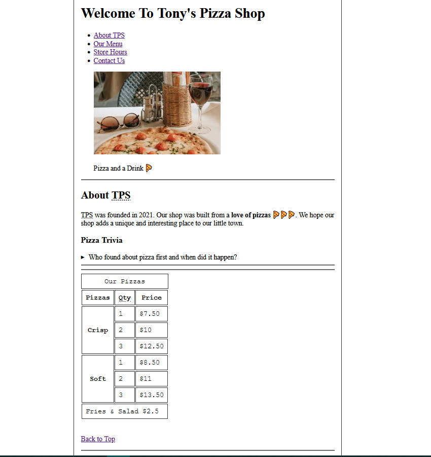
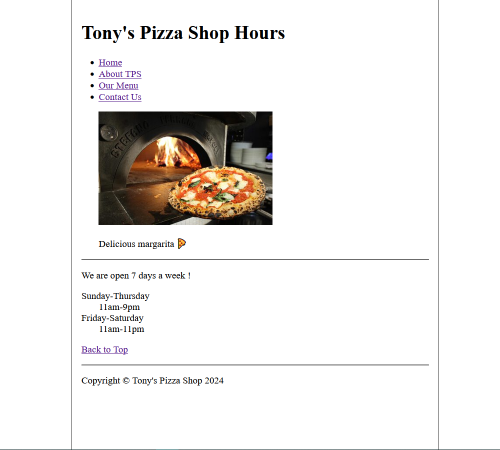
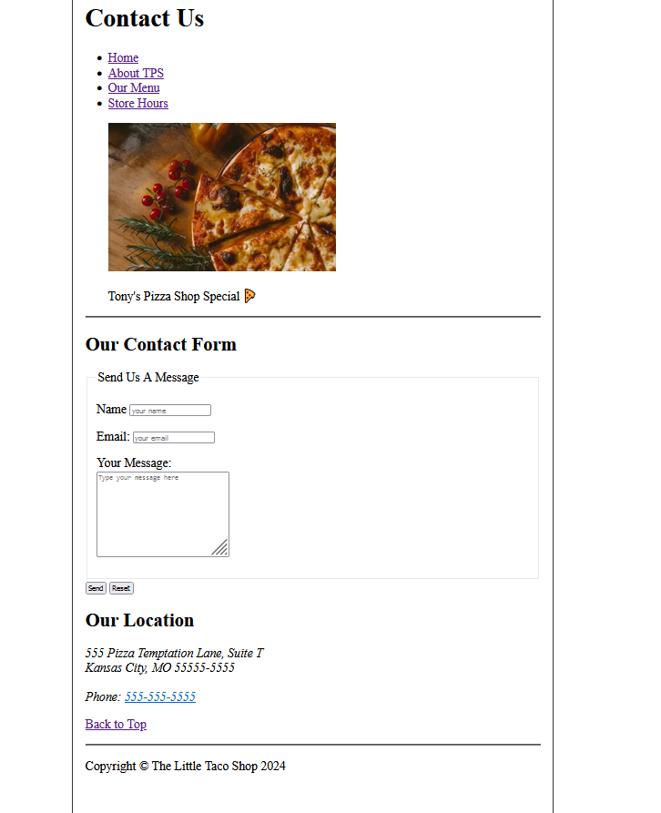

# Tony's Pizza Shop

Basic HTML page. Will be updated with semantic css shortly.

Check out the live version of the website here ----> [Tony's Pizza Shop](https://berkcantelseren.github.io/Tonys-Pizza-Shop/)

This project is a simple pizza shop website built entirely with HTML using semantic HTML elements. It is designed to showcase the offerings of a pizza shop in a clean and accessible manner.

## Features

- **Semantic HTML**: The website is structured using semantic HTML5 elements such as `<header>`, `<nav>`, `<main>`, `<section>`, `<article>`, `<footer>`, etc.
- **Responsive Layout**: Ensures a user-friendly experience across different devices.
- **Clean Design**: Focuses on simplicity and clarity to provide a great user experience.

## Semantic HTML Usage

- **`<header>`**: Contains the pizza shop's logo and navigation menu.
- **`<nav>`**: Provides a navigation bar to different sections of the website (e.g., Home, Menu, Contact).
- **`<main>`**: Includes the main content such as the menu, special offers, and customer reviews.
- **`<section>`**: Groups related content, such as a section for the pizza menu or promotional deals.
- **`<article>`**: Represents self-contained pieces of content, such as a featured pizza description.
- **`<footer>`**: Includes contact information, social media links, and copyright details.

## Challenge Details

This project was created as part of a challenge by [Dave Gray](https://www.youtube.com/@DaveGrayTeachesCode). His channel offers coding tutorials and challenges. Check it out !

## Future Improvements

- Add CSS for styling to improve the visual design.
- Incorporate JavaScript for interactivity (e.g., order form, dynamic updates).

## Acknowledgments

This project was created to demonstrate the use of semantic HTML in building a simple and accessible web page.

## Screenshots

### Home Page

### Hours Page

### Contact Page

